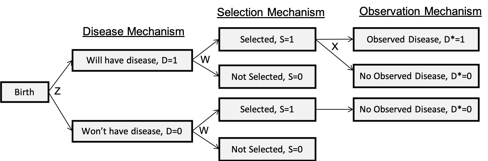

```{r, include = FALSE}
knitr::opts_chunk$set(
  collapse = TRUE,
  comment = "#>"
)
```

In this vignette, we provide a brief introduction to using the R package *SAMBA*
(sampling and misclassification bias adjustment). The purpose of this package is
to provide resources for fitting a logistic regression for a binary outcome in
the presence of outcome misclassification (in particular, imperfect sensitivity)
along with potential selection bias. We will not include technical details about
this estimation approach and instead focus on implementation. For additional
details about the estimation algorithm, we refer the reader to Beesley and
Mukherjee (2020) in *UNDER REVIEW*.


## Model Structure

Let binary $D$ represent a patient's true disease status for a disease of
interest, e.g. diabetes. Suppose we are interested in the relationship between
$D$ and and person-level information, $Z$. $Z$ may contain genetic information,
lab results, age, gender, or any other characteristics of interest. We call this
relationship the *disease mechanism* as in **Figure 1**.

Suppose we consider a large health care system-based database with the goal of
making inference about some defined general population. Let $S$ indicate whether
a particular subject in the population is sampled into our dataset (for example,
by going to a particular hospital and consenting to share biosamples), where
the probability of an individual being included in the current dataset may
depend on the underlying lifetime disease status, $D$, along with additional
covariates, $W$. $W$ may also contain some or all adjustment factors in $Z$.
In the EHR setting, we may often expect the sampled and non-sampled patients to
have different rates of the disease, and other factors such as patient age,
residence, access to care and general health state may also impact whether
patients are included in the study base or not. We will call this mechanism
the *selection mechanism.*

Instances of the disease are recorded in hospital or administrative records.
We might expect factors such as the patient age, the length of follow-up, and
the number of hospital visits to impact whether we actually *observe/record* the
disease of interest for a given person. Let $D^*$ be the *observed* disease
status. $D^*$ is a potentially misclassified version of $D$. We will call the
mechanism generating $D^*$ the *observation mechanism.* We will assume that
misclassification is primarily through underreporting of disease. In other
words, we will assume that $D^*$ has perfect specificity and potentially
imperfect sensitivity with respect to $D$. Let $X$ denote patient and
provider-level predictors related to the true positive rate (sensitivity).


```{r, echo=FALSE, fig.cap="Figure 1: Model Structure", out.width = '80%'}

```

We express the conceptual model as follows:

$$\text{Disease Model}: \text{logit}(P(D=1 \vert Z; \theta )) = \theta_0 + \theta_Z Z $$
$$\text{Selection Model}:  P(S=1 \vert D, W; \phi )$$
$$\text{Sensitivity/Observation Model}: \text{logit}(P(D^*=1 \vert D=1, S=1, X; \beta)) = \beta_0 + \beta_X X $$

## Simulate Data

We start our exploration by simulating some binary data subject to
misclassification of the outcome and selection bias. Variables related to
selection are D and W. Variables related to sensitivity are X. Variables of
interest are Z, which are related to W and X. In this simulation, W is also
independently related to D.

```{r, echo = TRUE, eval = TRUE,  fig.width = 7, fig.height = 4}
options(warn = -1)

library(SAMBA)
library(MASS)
expit <- function(x) exp(x) / (1 + exp(x))
logit <- function(x) log(x / (1 - x))

nobs <- 5000

### Generate Predictors and Follow-up Information
set.seed(1234)
cov <- mvrnorm(n = nobs, mu = rep(0, 3), Sigma = rbind(c(1,   0, 0.4),
                                                       c(0,   1,   0),
                                                       c(0.4, 0,   1)))

data <- data.frame(Z = cov[, 1], X = cov[, 2], W = cov[, 3])

# Generate random uniforms
set.seed(5678)
U1 <- runif(nobs)
set.seed(4321)
U2 <- runif(nobs)
set.seed(8765)
U3 <- runif(nobs)

# Generate Disease Status
DISEASE <- expit(-2 + 0.5 * data$Z)
data$D   <- ifelse(DISEASE > U1, 1, 0)

# Relate W and D
data$W <- data$W + 1 * data$D

# Generate Misclassification
SENS <- expit(-0.4 + 1 * data$X)
SENS[data$D == 0] = 0
data$Dstar <- ifelse(SENS > U2, 1, 0)

# Generate Sampling Status
SELECT <- expit(-0.6 + 1 * data$D + 0.5 * data$W)
S  <- ifelse(SELECT > U3, T, F)

# Observed Data
data.samp <- data[S,]

# True marginal sampling ratio
prob1 <- expit(-0.6 + 1 * 1 + 0.5 * data$W)
prob0 <- expit(-0.6 + 1 * 0 + 0.5 * data$W)
r.marg.true <- mean(prob1[data$D == 1]) / mean(prob0[data$D == 0])

# True inverse probability of sampling weights
prob.WD <- expit(-0.6 + 1 * data.samp$D + 0.5 * data.samp$W)
weights <- nrow(data.samp) * (1  / prob.WD) / (sum(1 / prob.WD))

# True associations with D in population
trueX <- glm(D ~ X, binomial(), data = data)
trueZ <- glm(D ~ Z, binomial(), data = data)

# Initial Parameter Values
fitBeta  <- glm(Dstar ~ X, binomial(), data = data.samp)
fitTheta <- glm(Dstar ~ Z, binomial(), data = data.samp)
```

## Estimating Sensitivity

In Beesley and Mukherjee (2020) (*UNDER REVIEW*), we develop several strategies
for estimating sensitivity as a function of covariates X. Here, we apply
several of the proposed strategies.

```{r}
# Using marginal sampling ratio r and P(D=1)
sens1 <- sensitivity(data.samp$Dstar, data.samp$X, mean(data$D),
                      r = r.marg.true)

# Using inverse probability of selection weights and P(D=1)
sens2 <- sensitivity(data.samp$Dstar, data.samp$X, prev = mean(data$D),
                     weights = weights)

# Using marginal sampling ratio r and P(D=1|X)
prev  <- predict(trueX, newdata = data.samp, type = 'response')
sens3 <- sensitivity(data.samp$Dstar, data.samp$X, prev, r = r.marg.true)

# Using inverse probability of selection weights and P(D=1|X)
prev  <- predict(trueX, newdata = data.samp, type = 'response')
sens4 <- sensitivity(data.samp$Dstar, data.samp$X, prev, weights = weights)
```
## Estimating log-odds ratio for D|Z

We propose several strategies for estimating the association between D and Z
from a logistic regression model in the presence of different biasing factors.
Below, we provide code for implementing these methods.

```{r}
# Approximation of D*|Z
approx1 <- approxdist(data.samp$Dstar, data.samp$Z, sens1$c_marg,
                      weights = weights)

# Non-logistic link function method
nonlog1 <- nonlogistic(data.samp$Dstar, data.samp$Z, c_X = sens3$c_X,
                       weights = weights)

# Direct observed data likelihood maximization without fixed intercept
start <- c(coef(fitTheta), logit(sens1$c_marg), coef(fitBeta)[2])
fit <- obsloglik(data.samp$Dstar, data.samp$Z, data.samp$X, param_current = start,
                 weights = weights)

obsloglik1 <- list(param = fit$param, variance = diag(fit$var))

# Direct observed data likelihood maximization with fixed intercept
start <- c(coef(fitTheta), logit(sens1$c_marg), coef(fitBeta)[2])
fit   <- obsloglik(data.samp$Dstar, data.samp$Z, data.samp$X, param_current = start,
                 beta0_fixed = logit(sens1$c_marg), weights = weights)

obsloglik2 <- list(param = fit$param, variance = diag(fit$var))
```
## Plotting sensitivity estimates

**Figure 2** shows the estimated individual-level sensitivity values when the
marginal sampling ratio (r-tilde) is correctly specified. We can see that there
is strong concordance with the true sensitivity values.
```{r, echo = FALSE, eval = TRUE,  fig.width = 5, fig.height= 5}
plot(sort(sens3$c_X), xlab = 'Patients', ylab = 'Sensitivity',
     main = 'Figure 2: Sensitivity Estimates', type = 'l', col = 'red', lwd = 2)
lines(sort(expit(obsloglik1$param[3] + obsloglik1$param[4]*data.samp$X)), col = 'blue', lwd = 2)
lines(sort(expit(obsloglik2$param[3] + obsloglik2$param[4]*data.samp$X)), col = 'green', lwd = 2)
abline(h=sens1$c_marg, col = 'purple', lwd = 2)
lines(sort(expit(-0.4 + 1*data.samp$X)), col = 'black', lwd = 2)
legend(x='topleft', fill = c('purple', 'red','blue', 'green', 'black'),
       legend = c('Estimated marginal sensitivity',
                  'Using non-logistic link method',
                  'Using obs. data log-lik',
                  'Using obs. data log-lik (fixed intercept)',
                  'Truth'), cex = 0.7)
```

**Figure 3** shows the estimated individual-level sensitivity values across
different marginal sampling ratio values. In reality, we will rarely know the
truth, and this strategy can help us obtain reasonable values for sensitivity
across plausible sampling ratio values.

```{r, echo = FALSE, eval = TRUE,  fig.width = 5, fig.height= 5,  results='hide'}
rvals = c(1,1.5,2,2.5,5,10)
COL = c('red', 'orange', 'yellow', 'green', 'blue', 'purple')
true_prevs = predict(trueX, newdata = data.samp, type = 'response')
plot(sort(expit(-0.4 + 1*data.samp$X)), xlab = 'Patients', ylab = 'Sensitivity',
main = 'Figure 3: Estimated sensitivity across \n marginal sampling ratios',
type = 'l', col = 'black', lwd = 2, ylim = c(0,1))

for (i in 1:length(rvals)) {
  TEMP <- sensitivity(X = data.samp$X, Dstar = data.samp$Dstar,  r = rvals[i], prev = true_prevs)
  lines(sort(TEMP$c_X), col = COL[i])
}
legend(x='topleft', legend = c(rvals, 'Truth'), title = 'Sampling Ratio',
       fill = c(COL, 'black'), cex = 0.8)
```


## Plotting log-odds ratio estimates
```{r, echo = FALSE, eval = TRUE,  fig.width = 7, fig.height= 4, message=FALSE}
library(ggplot2)
library(scales)
```

**Figure 4** shows the estimated log-odds ratio relating $D$ and $Z$ for the
various analysis methods. Uncorrected (complete case with misclassified outcome)
analysis produces bias, and some methods reduce this bias. Recall, this is a
single simulated dataset, and the corrected estimators may not always equal
the truth for a given simulation. When $W$ and $D$ are independently associated,
the method using the approximated $D^* \vert Z$ relationship and marginal
sensitivity can sometimes perform poorly.

```{r, echo = FALSE, eval = TRUE,  fig.width = 7, fig.height= 4}
METHODS = c('True',  'Uncorrected', 'Approx D*|Z + IPW','Non-logistic Link + IPW','Obs. log-lik + IPW', 'Fixed intercept obs. log-lik + IPW')
PARAM = c( coef(trueZ)[2], coef(fitTheta)[2],approx1$param,  nonlog1$param[2], obsloglik1$param[2], obsloglik2$param[2] )
VARIANCE = c(diag(summary(trueZ)$cov.scaled)[2],diag(summary(fitTheta)$cov.scaled)[2],
             approx1$variance,nonlog1$variance[2],obsloglik1$variance[2], obsloglik2$variance[2])
pd = position_dodge(width=0.6)
a <- ggplot(data = data.frame(METHODS = METHODS, PARAM = PARAM, VARIANCE = VARIANCE),
       aes(xmin= METHODS, xmax = METHODS, ymin = PARAM - 1.96*sqrt(VARIANCE), ymax =  PARAM + 1.96*sqrt(VARIANCE),
           col = METHODS,x = METHODS, y = PARAM)) +
  geom_point(position = position_dodge(.7), size = 2) +
  geom_linerange(position = position_dodge(.7), size = 1.2) +
  xlab('') + ylab('logOR')+ggtitle('Figure 4: Estimated Log-Odds Ratio Across Methods')+
  scale_x_discrete(limits=METHODS)+
  geom_hline(yintercept = PARAM[1], linetype = 1, color = 'black')+
  guides(fill=guide_legend(nrow=2,byrow=TRUE))+
  theme(legend.position="top",panel.grid.major = element_blank(),
        panel.grid.minor = element_blank(), legend.text=element_text(size=8), legend.title = element_blank(),
        axis.text.x=element_text(angle=20,hjust=1,vjust=1), text = element_text(size=12))
print(a)
```
